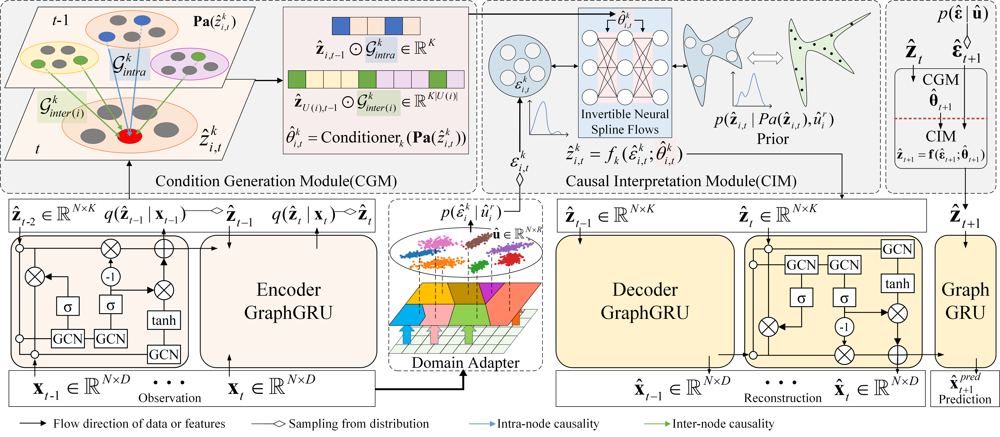

# Generative Causal Interpretation Model (GCIM)
This is the official release code of KDD2023 accepted paper: "Generative Causal Interpretation Model for Spatio-Temporal Representation Learning"

The complete code will be released after the conference, please stay tuned

# Abstract
Learning, interpreting, and predicting from complex and high-dimensional spatio-temporal data is a natural ability of humans and other intelligent agents, 
and one of the most important and difficult challenges of AI. Although objects may present different observed phenomena under different situations, 
their causal mechanism and generation rules are stable and invariant. Different from most existing studies that focus on dynamic correlation, 
we explore the latent causal structure and mechanism of causal descriptors in the spatio-temporal dimension at the microscopic level, 
thus revealing the generation principle of observation. 
In this paper, we regard the causal mechanism as a spatio-temporal causal process modulated by non-stationary exogenous variables. 
To this end, we propose a theoretically-grounded Generative Causal Interpretation Model (GCIM), 
which infers explanatory-capable microscopic causal descriptors from observational data via spatio-temporal causal representations. 
The core of GCIM is to estimate the prior distribution of causal descriptors by using the spatio-temporal causal structure and transition process under the constraints of identifiable conditions, 
thus extending the Variational AutoEncoder (VAE). Furthermore, our method is able to automatically capture domain information from observations to model non-stationarity. 
We further analyze the model identifiability, showing that the proposed model learned from observations recovers the true one up to a certain degree. 
Experiments on synthetic and real-world datasets show that GCIM can successfully identify latent causal descriptors and structures, and accurately predict future data.



<!--
# How to run
It's very simple to run, just modify the `config_filename` in `main.py`

Change `test_only=True` in `data/ ckpt /data_name/config_NYC.yaml`

`data_name = 'NYC'` Test the NYC dataset

# Train

Change `test_only=False` in `data/ ckpt /data_name/config_NYC.yaml`

`data_name = 'NYC'` Train the NYC dataset

-->

# Extensibility
Other additional features will be released one after another

Thank you for your attention to our work

If you find this repository, e.g., the code and the datasets, useful in your research, please cite the following paper:

```
@inproceedings{ZhaoKDD2023GCIM,
    title={Generative Causal Interpretation Model for Spatio-Temporal Representation Learning},
    author={Zhao, Yu and Deng, Pan and Liu, Junting and Jia, Xiaofeng and Zhang, Jianwei},
    booktitle={Proceedings of the 29th ACM SIGKDD Conference on Knowledge Discovery \& Data Mining (KDD ’23)},
    DOI={https://doi.org/10.1145/3580305.3599363},
    year={2023},
}
```